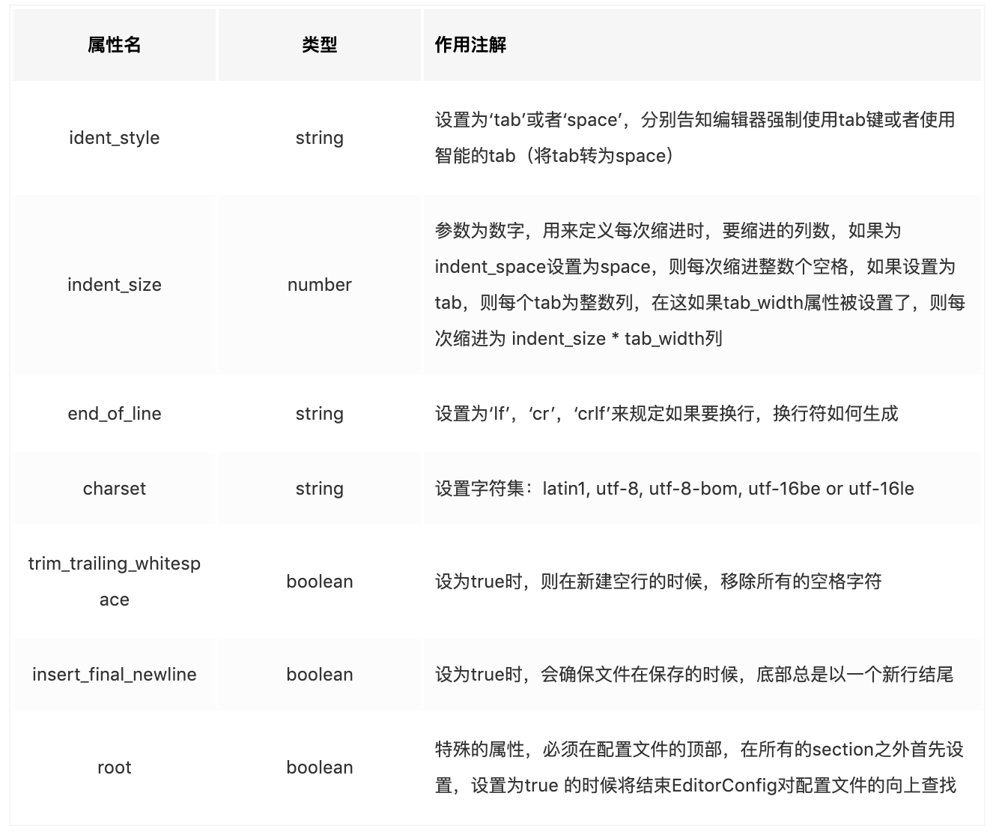

## EditorConfig是什么？

EditorConfig是一套用于统一代码格式的解决方案。它可以帮助开发者在不同的编辑器和IDE之间定义和维护一致的代码风格。

## 如何使用EditorConfig？

1、在项目根创建一个名为 `.editorconfig` 的文件。该文件的内容定义该项目的编码规范。
2、安装与编辑器对应的 `EditorConfig 插件`。

**注意**：编辑器是否需要安装插件可以[查看官网列出的统计](https://editorconfig.org/) 

**其工作原理**：
* 当打开一个文件时，EditorConfig插件会在打开文件的目录和其每一级父目录查找`.editorconfig`文件，直到有一个配置文件`root=true`。
* EditorConfig配置文件从上往下读取，并且路径最近的文件最后被读取。匹配的配置属性按照属性应用在代码上，所以最接近代码文件的属性优先级最高。

## EditorConfig文件编码规范

### 通配符


### 支持的属性(常用的)



注意：不是每种插件都支持所有的属性，完整版见[这里](https://github.com/editorconfig/editorconfig/wiki/EditorConfig-Properties)。

**官方例子**：

```
# top-most EditorConfig file
root = true

# Unix-style newlines with a newline ending every file
[*]
end_of_line = lf
insert_final_newline = true

# Matches multiple files with brace expansion notation
# Set default charset
[*.{js,py}]
charset = utf-8 

# 4 space indentation
[*.py]
indent_style = space
indent_size = 4

# Tab indentation (no size specified)
[*.js]
indent_style = tab

# Indentation override for all JS under lib directory
[lib/**.js]
indent_style = space
indent_size = 2

# Matches the exact files either package.json or .travis.yml
[{package.json,.travis.yml}]
indent_style = space
indent_size = 2
```

最后附上我的 `.editorconfig` 文件：

```
root = true

[*]
charset = utf-8
indent_style = space
indent_size = 2
end_of_line = lf
insert_final_newline = true
trim_trailing_whitespace = true
```


