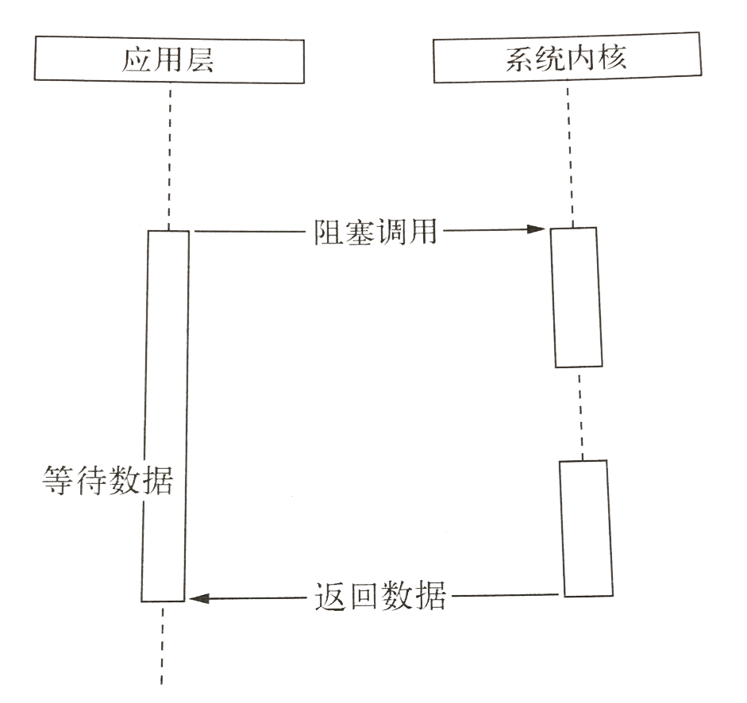

## I/O
I/O（input/output），即输入/输出端口。每个设备都会有一个专用的I/O地址，用来处理自己的输入输出信息。

### I/O管理示意图:


### I/O的特点

* `I/O`性能经常称为系统性能的瓶颈
* 操作系统庞大复杂的原因之一：资源多、杂，并发，均来自`I/O`
* 与其他功能联系密切，特别是文件系统。

### 常见的I/O流


## 为什么要异步I/O

Web应用已经不再是单台服务器就能胜任的时代，在跨网络的结构下，并发已经是现代编程中的标准配备了。具体到实处，则可以从**用户体验**和**资源分配**这两个方面说起。

* **用户体验** 因为在浏览器中JavaScript在单线程上执行，而且它还与UI渲染共用一个线程，这意味着JavaScript在执行的时候UI渲染和响应是处于停滞状态。

* **资源分配** 主流方法有两种：`单线程串行依次执行`，`多线程并行完成`
**多线程缺点：** 多线程并行的代价在于创建线程和执行期线程上下文切换的开销较大，且在复杂业务中，多线程编程经常面临锁、状态同步等问题。
**单线程缺点：** 单线程串行执行的缺点在于性能，任意一个略慢的任务都会导致后续执行代码被阻塞。

## 异步I/O与非阻塞I/O   
在听到Node的介绍时，我们时常会听到异步、非阻塞、回调、事件这些词混合在一起推介出来，其中异步与非阻塞听起来似乎是同一回事。从实际效果而言，异步和非阻塞都达到了我们并行I/O的目的。但是从计算机内核I/O而言，异步/同步和阻塞/非阻塞实际上是两回事。
操作系统内核对I/O只有两种方式：`阻塞`与`非阻塞`。
**阻塞I/O**
在调用阻塞I/O时，应用程序需要等待I/O完成才返回结果。


阻塞I/O的一个特点是调用之后一定要等到系统内核层面完成所有操作后，调用才结束。这造成CPU等待I/O，浪费时间，CPU的处理能力不能得到充分利用。

**非阻塞I/O**
非阻塞I/O与阻塞I/O的区别在于阻塞I/O完成整个获取数据的过程，而非阻塞I/O则不带数据直接返回，要获取数据，还需要通过文件描述符再次读取。


但是非阻塞I/O也存在一些问题。由于完整的I/O并没有完成，立即返回的并不是业务层期望的数据，而仅仅是当前调用的状态。为了获取完整的数据，应用程序需要重复调用I/O操作来确认是否完成。这种重复调用判断操作是否完成的技术叫做`轮询`。

**轮询**
轮询技术主要有以下这些：`read`、`select` 、`poll` 、`epoll` 、`kqueue`。        
`read`是性能最低的一种，它通过重复调用来检查I/O的状态来完成完整数据读取。       
`select`是在read的基础上改进的一种方案，通过对文件描述符上的事件状态来进行判断。 select具有一个较弱的限制，它最多可以同时检查1024个文件描述符。           
`poll`改方案较select有所改进，采用链表的方式避免数组长度的限制，其次它能避免不要的检查。但是当文件描述符较多的时候，它的性能还是十分低下的。      
`epoll`该方案是Linux下效率最高的I/O事件通知机制，在进入轮询的时候如果没有检查到I/O事件，将会进行休眠，直到事件发生将它唤醒。它是真实利用了事件通知、执行回调的方式，而不是遍历查询，所有不会浪费CPU，执行效率高。        
`kqueue`该方案的实现方式与epoll类似，不过它仅在FreeBSD系统下存在。


## 异步I/O操作调用流程


主线程就是nodejs所谓的单线程，也就是用户javascript代码运行的线程。
IO线程是由Libuv(Linux下由libeio具体实现；window下则由IOCP具体实现)管理的线程池控制的，本质上是多线程。即采用了线程池与阻塞IO模拟了异步IO。


## Node的异步I/O

Node完成整个异步I/O环节的有`事件循环`、`观察者`、`请求对象`和`执行回调`。

### 事件循环

Node的自身的执行模型 —— `事件循环`，正是它使得回调函数十分普遍。     
在进程启动时，Node便会创建一个类似于while(true)的循环，每执行一次循环体的过程我们称为Tick。每个Tick的过程就是查看是否有事件待处理，如果有，就取出事件及其相关的回调函数。如果存在关联的回调函数，就执行它们。然后进入下个循环体，如果不再有事件处理，就退出进程。          
流程图如下：


### 观察者

在每个Tick的过程中，如何判断是否有事件需要处理呢？这里必须要引入的概念是`观察者`。每个事件循环中有一个或多个观察者，而判断是否有事件要处理的过程就是向这些观察者询问是否有要处理的事件。一个观察者里可能有多个事件。         
浏览器采用了类似的机制。事件可能来自用户的点击或者加载某些文件时产生，而这些产生的事件都有对应的观察者。在Node中，事件主要来源于网络请求、文件I/O等，这些事件对应的观察者有文件I/O观察者、网络I/O观察者等。观察者将事件进行了分类。             
事件循环是一个典型的`生产者/消费者模型`。异步I/O、网络请求等则是事件的生产者，源源不断为Node提供不同类型的事件，这些事件被传递到对应的观察者那里，事件循环则从观察者那里取出事件并处理。          
在`Windows`下，这个循环基于IOCP创建，而在`*nix`下则基于多线程创建。


### 请求对象

对于Node中的异步I/O调用而言，回调函数却不由开发者来调用。那么从我们发出调用后，到回调函数被执行，中间发生了什么呢？事实上，从JavaScript发起调用到内核执行完I/O操作的过渡过程中，存在一种中间产物，它叫做`请求对象`。            
以Windows下的文件操作为例（ 利用IOCP实现 ），新建一个文件yzx_file.js ，内容如下：
```
var fs = require('fs');
var path = require('path');

fs.readFile(__dirname + '/test01.txt', {flag: 'r+', encoding: 'utf8'}, function (err, data) {

    console.log(data); //打印test01.txt文本内容
});
```

整个文件操作的调用过程如下：         
1）首先，用户写的javascript调用Node的核心模块fs.js ；        
2）接下来，Node的核心模块调用C++内建模块node_file.cc ；         
3）最后，根据不同平台（Linux或者window），内建模块通过libuv进行系统调用           
至此，JavaScript调用立即返回，由JavaScript层面发起的异步调用的第一阶段就此结束。JavaScript线程可以继续执行当前任务的后续操作。当前的I/O操作在线程池中等待执行，不管它是否阻塞I/O，都不会影响到JavaScript线程的后续执行，如此就达到了异步的目的。

请求对象是异步I/O过程中的重要中间产物，所有的状态都保存在这个对象中，包括送入线程池等待执行以及I/O操作完毕后的回调函数。

### 执行回调

组装好请求对象、送入I/O线程池等待执行，实际上完成了异步I/O的第一部分，回调通知是第二部分。         
线程池中的I/O操作调用完毕之后，会将获取的结果存储在req->result属性上，然后调用PostQueuedCompletionStatus()通知 IOCP,告知当前对象操作已经完成。      
PostQueuedCompletionStatus()方法的作用是向 IOCP 提交执行状态，并将线程归还线程池。在这个过程中，我们其实还动用了事件循环的I/O观察者。在每次Tick的执行中，它会调用 IOCP 相关的GetQueuedCompletionStatus()方法检查线程池中是否有执行完的请求，如果存在，会将请求对象加入到I/O观察者的队列中，然后将其当做事件处理。        
I/O观察者回调函数的行为就是取出请求对象的result属性作为参数，取出oncomplete_sym属性作为方法，然后调用执行，以此达到调用JavaScript中传入的回调函数的目的。
至此，整个异步I/O的流程完全结束。如下图：

`事件循环`、`观察者`、`请求对象`、`I/O线程池`这四者共同构成了Node异步I/O模型的基本要素。

