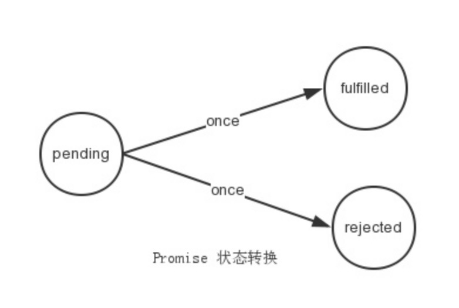
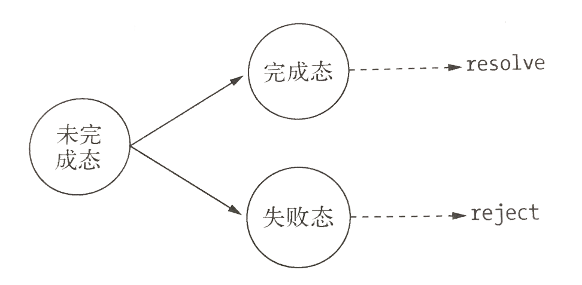
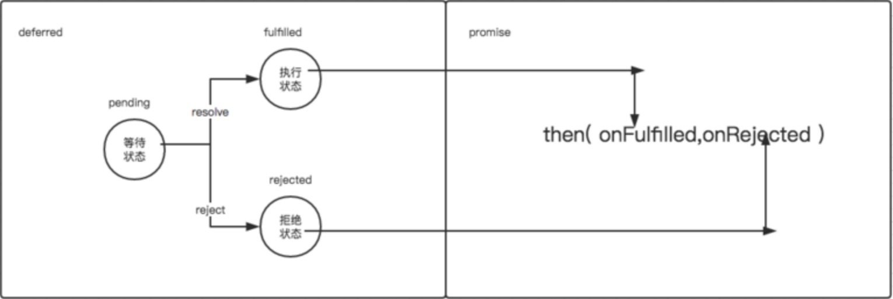

## 异步编程的优势与难点

**优势**：非阻塞I/O可以使CPU与I/O并不相互依赖等待，让资源得到更好的利用。对于网络应用而言，并行带来的想象空间更大，延展而开的是分布式和云。并行使得各个单点之间能够更有效地组织起来。

**难点**：`异常处理`、`函数嵌套过深`、`阻塞代码`、`多线程编程`、`异步转同步`。        
`异常处理`：过去我们处理异常时，通常使用try/catch/final语句进行异常捕获。异步I/O的实现主要包含两个阶段：提交请求和处理结果。这两个阶段中间有事件循环的调度，两者彼此不关联。异步方法则通常在第一个阶段提交请求后立即返回，因为异常并不一定发生在这个阶段，try/catch的功效在此处不会发挥任何作用。       
Node在处理异常上形成了一种约定，将异常作为回调函数的第一个实参传回，如果为空值，则表明异步调用没有异常抛出。所以在我们自行编写的异步方法上，也需要去遵循这样一些原则：      
1）必须执行调用者传入的回调函数；     
2）正确传递回异常供调用者判断。     
`函数嵌套过深`：异步调用会导致函数嵌套。        
`阻塞代码`：JavaScript没有sleep()这样的线程沉睡功能，这样会造成CPU资源被占用，导致其余任何请求都会得不到响应。
`多线程编程`：JavaScript是单线程的，随着现今业务的复杂化，对于多核CPU利用的要求也越来越高。浏览器提出了Web Workers，它通过将JavaScript执行与UI渲染分离，可以很好的利用多核CPU为大量的计算服务。前端Web Workers也是一个利用消息机制合理使用多核CPU的理性模型。借助Web Workers的模式，开发人员要更多的去面临跨线程的编程，这对于以往的JavaScript编程经验是较少考虑的。          
`异步转同步`：Node提供了绝大部分的异步API和少量的同步API，偶尔出现的同步需求将会因为没有同步API让开发者突然无所适从。

## 异步编程解决方案
前面列举了因异步编程带来的一些问题，与异步编程提升的性能成果相比，编程过程看起来似乎没有想象中的那么美好。与问题相比，解决问题的方案总是更多。        
异步编程的主要解决方案有：
ES 6以前：`回调函数`、`事件发布/订阅模式`、`Promise/Deferred模式`、`流程控制库`
ES 6：`Generator函数`
ES 7: `async`和`await`

### 回调函数
这是异步编程最基本的方法。
```
//假定有两个函数f1和f2，后者等待前者的执行结果。
f1();
f2();
//如果f1是一个很耗时的任务，可以考虑改写f1，把f2写成f1的回调函数。
function f1(callback){
　　setTimeout(function () {
　　　　// f1的任务代码
　　　　callback();
　　}, 1000);
}
//执行代码就变成下面这样：
　f1(f2);
```
采用这种方式，我们把同步操作变成了异步操作，f1不会堵塞程序运行，相当于先执行程序的主要逻辑，将耗时的操作推迟执行。

回调函数的优点是简单、容易理解和部署，缺点是不利于代码的阅读和维护，各个部分之间高度耦合，流程会很混乱，而且每个任务只能指定一个回调函数。

### 事件发布/订阅模式
事件监听器模式是一种广泛用于异步编程的模式，是回调函数的事件化，又称`发布/订阅模式`。
以node为例：
```
var events = require('events');
var emitter = new events.EventEmitter();
//订阅 
emitter.on('event1', function(message){
	console.log(message);
});
//发布
emitter.emit('event1', "I am message!");

```
`事件发布/订阅模式`可以实现一个事件与多个回调函数的关联，这些回调函数又称为`事件侦听器`。通过emit()发布事件后，消息会立即传递给当前事件的所有侦听器执行。侦听器可以灵活的添加和删除，使得事件和具体处理逻辑之间可以很轻松的关联和解耦。      
`事件发布/订阅模式`自身并无同步和异步调用的问题，但在Node中，emit()调用多半是伴随事件循环而异步触发的，所以我们说事件发布/订阅广泛应用于异步编程。

Node对事件发布/订阅的机制做了一些额外的处理：       
* **如果对一个事件添加了超过10个侦听器，将会得到一条警告。**这一出设计与Node自身单线程运行有关，设计者认为侦听器太多可能会造成内存泄露，所以存在这样一条警告。另一方面，由于事件发布会引起一系列侦听器执行，如果事件相关的侦听器太多，可能存在过多占用CPU的情景。
* **为了处理异常，EventEmitter对象对error事件进行了特殊对待。**如果运行期间的错误触发了error事件，EventEmitter会检查是否有对error事件添加过侦听器。如果添加了，这个错误将会交给侦听器处理，否则这个错误将会作为异常抛出。如果外部没有捕获这个异常，将会引起线程退出。


### Promise/Deferred模式

Promise/Deferred模式其实包含两部分，即`Promise`和`Deferred`。

#### Promise
**Promise/A+规范：**
* Promise操作只会处在3种状态的一种：未完成态(pending)、完成态(fulfilled)和失败态(rejected)。
* Promise的状态只会出现从未完成态向完成态或失败态转化，不能逆反。完成态和失败态不能互相转化。
* Promise的状态一旦转化，将不能更改。
Promise的状态转化示意图如下：

* Promise 有一个 then 方法，then 方法可以接受 3 个函数作为参数。前两个函数对应 promise 的两种状态 fulfilled 和 rejected 的回调函数。第三个函数用于处理进度信息（对进度回调的支持是可选的）。then()方法只接受function对象，其余对象将被忽略。then()方法继续返回Promise对象，以实现链式调用。
```
then(fulfilledHandler, errorHandler, progressHandler)
```

代码如下：
```
//Promise
function Promise() {
    this.handler = {};
}
Promise.prototype.then = function (onFulfilled, onRejected) {
    var handler = {}
    if (typeof onFulfilled === 'function') {
        handler.resolve = onFulfilled
    }
    if (typeof onRejected === 'function') {
        handler.reject = onRejected
    }
    this.handler = handler
    return this
}
```


#### Deferred
then()方法所做的事情是将回调函数存放起来。为了完成整个流程，还需要触发执行这些回调函数的地方，实现这些功能的对象通常被称为Deferred，即延迟对象。
代码如下：
```
function Deferred() {

    /* 状态：默认 等待态 pending */
    this.state = 'pending';

    this.promise = new Promise()
}

Deferred.prototype.resolve = function (obj) {
    this.state = 'fulfilled'
    var handler = this.promise.handler
    if (handler && handler.resolve) {
        handler.resolve(obj)
    }
}

Deferred.prototype.reject = function (obj) {
    this.state = 'rejected'
    var handler = this.promise.handler
    if (handler && handler.reject) {
        handler.reject(obj)
    }
}
```
这里的状态和方法之间的对应关系图：

Promise和Deferred的差别：Deferred主要是用于内部，用于维护异步模型的状态。Promise则作用于外部，通过then()方法暴露给外部，以添加自定义逻辑。整体关系如下图：

Promise/Deferred模式，将业务中不可变的部分封装在了Deferred中，将可变的部分交给了Promise。


### 流程控制库
这里简单提一下几个主流的流程控制库：`尾触发与Next`、`async`、`Step`、`wind`;

#### 尾触发与Next
除了事件和Promise外，还有一类方法是需要手工调用才能持续执行后续调用的，我们将此类方法叫做`尾触发`，常见的关键词是next。事实上尾触发目前应用最多的地方是Connect的中间件。

#### async
async是nodejs里的流程控制模块,也可以用在浏览器端,主要是用来控制多个异步调用时的顺序以及依赖。async模块提供了20多个方法用于处理异步的各种协作模式，这里只介绍几种典型用法。
* 异步的串行执行`async.series()`;
series允许传递两个参数，第一个参数代表要异步执行的所有函数,后一个参数是当前面所有异步执行完之后执行的一个回调函数,只要有一个异步方法异步,则直接执行回调函数,err参数就是异常信息,当所有的异步方法执行成功之后,回调函数里的result保存的前面所有异步方法执行的结果.注意代码里的callback为async自己传递的固定参数不可更改.
```
//串行执行多个异步方法,使嵌套调用扁平化
async.series([
function(callback){
    fs.readFile('../data/file.txt', 'utf8', callback);
},
function(callback){
    fs.readFile('../data/file1.txt', 'utf8', callback);
}],
function(err, results){
    if(err) {
        console.log(err)
    }else{
        console.log(results);
    }
});

```
* 异步的并行执行`async.parallel()`;
parallel在执行没有依赖关系的异步操作时候，效率还是不错的,回调函数跟上面的series一样,只要有一个异步方法出现异常,则传递异常信息给回调的第一个参数,都成功则results返回包含所有结果的数组.注意代码里的callback为async自己传递的固定参数不可更改.
```
//并行执行多个异步方法,并返回多个结果组成的数组
async.parallel([
function(callback){
    fs.readFile('../data/file.txt', 'utf8', callback);
},
function(callback){
    fs.readFile('../data/file1.txt', 'utf8', callback);
}],
function(err, results){
    if(err) {
        console.log(err)
    }else{
        console.log(results);
    }
});

```

* 异步调用的依赖处理`async.waterfall()`;
waterfall方法就是用来处理异步方法之间的依赖的,这里跟上面的区别在于callback方法传递了两参数,null,content, 第一个参数代表是否异常;第二个参数代码当前异步方法返回的结果,这个值将会作为下一个异步方法的参数,比如这里的function(arg1, callback) ,arg1参数就是前一个异步方法返回传递的结果,假如后面的异步方法不需要前面的依赖则不用传递这个参数,像上面的第二异步方法那样。注意代码里的callback为async自己传递的固定参数不可更改.
```
//前面异步方法返回的结果作为后面异步方法的条件,依次串行执行异步方法,最后返回最后一个异步方法的结果
async.waterfall([
function(callback){
    fs.readFile('../data/file.txt', 'utf8', function(err, content){
        callback(err, content);
    })
},
function(arg1, callback){
    fs.readFile('../data/' + arg1, 'utf8', callback);
}], 
function(err, results){
    if(err) {
        console.log(err)
    }else{
        console.log(results);
    }
})

```
* 自动依赖处理`async.auto()`;
auto方法会根据异步方法里的依赖关系,保证在依赖方法执行完成之后再去执行异步方法,auto允许传递两个参数,第一个参数是异步方法关系的定义,是一个key-vale方式的键值对,值传递单个函数则表示没有依赖,传递数组的话,数组内前面写上依赖的键值,最后写上异步方法.注意这里的异步方法会依赖前面异步方法返回的结果,所以callback会传递两参数,异常和结果
```
//智能根据配置文件执行异步方法,支持一对多的情况
var deps = {
    'file': function(callback){
        fs.readFile('../data/file.txt', 'utf8', function(err, content){
            callback(err, content); // => file1.txt
        });
    },
    'file1': function(callback){
        fs.readFile('../data/file2.txt', 'utf8', function(err, content){
            callback(err, content); // => ../data/
        });
    },
    'action': ['file', 'file1', function(callback, result){
        fs.readFile(result.file1 + result.file, 'utf8', function(err, content){
            callback(err, { result: content, xuwm: 'feenan'});
        });
    }]
};

async.auto(deps, function(err, result){
    console.log(result);
});

```


#### Step
Step它比async更轻量，在API的暴露上也更具备一致性，因为它只有一个接口Step。
```
Step(task1,task2,task3);
```
* 串行任务执行 （默认）
Step接受任意数量的任务，所有的任务都将会串行依次执行。Step 利用 this 对象指针来封装工作流。
```
    Step(  
      function readSelf() {  
        fs.readFile(__filename, this); // 把 this 送入 readFile 的异步参数中。此时 this 其类型为 function  
        // 注意这里无须 return 任何值  
      },  
      function capitalize(err, text) { // err 为错误信息，如果有则抛出异常  
        if (err) throw err;  
        return text.toUpperCase();     // text 为 上个步骤 readFile 的值也就是文件内容。注意此处有返回值供下一步所用。  
      },  
      function showIt(err, newText) {  
        if (err) throw err;  
        console.log(newText);  
      }  
    );  
```
* 并行任务执行 
this具有一个parallel()方法，它告诉Step，需要等待所有任务完成时才进行下一个任务。
```
Step(  
      // 同时执行两项任务 Loads two files in parallel  
      function loadStuff() {  
        fs.readFile(__filename, this.parallel());  
        fs.readFile("/etc/passwd", this.parallel());  
      },  
      // 获取结果 Show the result when done  
      function showStuff(err, code, users) {  
        if (err) throw err;  
        console.log(code);  
        console.log(users);  
      }  
)  
```

* 结果分组
如果不确定多个异步任务的数量，可以使用 this.group()。
```
    Step(  
      function readDir() {  
        fs.readdir(__dirname, this);  
      },  
      function readFiles(err, results) {  
        if (err) throw err;  
        // 创建 group，其实内部创建一个 results 数组，保存结果  
        var group = this.group();  
        results.forEach(function (filename) {  
          if (/\.js$/.test(filename)) {  
            fs.readFile(__dirname + "/" + filename, 'utf8', group()); // group() 内部其逻辑与 this.parallel，也是调度 index/pending。  
          }  
        });  
      },  
      function showAll(err , files) {  
        if (err) throw err;  
        console.dir(files);  
      }  
    );  
```

#### wind
Wind.js是很有特点的一个JavaScript异步编程类库（其前身为Jscex）, Wind.js的唯一目的便是“改善编程体验”，改善的“程度”以及改善的“方式”便是Wind.js与其他异步流程控制方案最大的区别。Wind.js的设计思路便是将这种抽象构建为JavaScript本身。通过$await函数标识对代码进行自动重写，JIT编译(Just in Time)，从而避免人工的预编译。    
在wind的世界里巧妙的利用了eval()访问上下文的特性。
wind提供了$await()方法实现等待完成异步方法。但事实上，它并不是一个方法，也不存在于上下文中，只是一个等待的占位符，告知编译器这里需要等待。
* 串行任务执行 
```
var Wind = require("wind");
var Task =  Wind.Async.Task;

var A = eval(Wind.compile("async", function () {
    console.log("Start A");
    $await(Wind.Async.sleep(3000));
    console.log("Finish A");
}));

var B = eval(Wind.compile("async", function () {
    console.log("Start B");
    $await(Wind.Async.sleep(5000));
    console.log("Finish B");
}));

var C = eval(Wind.compile("async", function () {
    console.log("Start C");
    console.log("Finish C");
}));

var task = eval(Wind.compile("async", function () {
    $await(A());
    $await(B());
    $await(C());
}));
task().start();

//结果 
Start A
Finish A
Start B
Finish B
Start C
Finish C

```


* 串行 + 并行任务执行 
```
var Wind = require("wind");
var Task =  Wind.Async.Task;

var A = eval(Wind.compile("async", function () {
    console.log("Start A");
    $await(Wind.Async.sleep(3000));
    console.log("Finish A");
}));

var B = eval(Wind.compile("async", function () {
    console.log("Start B");
    $await(Wind.Async.sleep(5000));
    console.log("Finish B");
}));

var C = eval(Wind.compile("async", function () {
    console.log("Start C");
    console.log("Finish C");
}));

var task = eval(Wind.compile("async", function () {
    $await(Task.whenAll(A(),B()));
    $await(C());
}));
task().start();

//结果
Start A
Start B
Finish A
Finish B
Start C
Finish C
```

### Generator 函数
Generator 函数是 ES6 提供的一种异步编程解决方案，语法行为与传统函数完全不同。

* **从语法上，Generator 函数是一个状态机，封装了多个内部状态。执行 Generator 函数会返回一个遍历器对象。**也就是说，Generator 函数除了状态机，还是一个遍历器对象生成函数。返回的遍历器对象，可以依次遍历 Generator 函数内部的每一个状态。
* **形式上，Generator 函数是一个普通函数**，但是有两个特征。一是，`function`关键字与函数名之间有一个星号；二是，函数体内部使用`yield`表达式，定义不同的内部状态。
* Generator 函数的调用方法与普通函数一样，也是在函数名后面加上一对圆括号。不同的是，调用 Generator 函数后，该函数并不执行，返回的也不是函数运行结果，而是一个指向内部状态的指针对象。下一步，必须调用遍历器对象的`next`方法，使得指针移向下一个状态。
代码示例如下：
```
function* helloWorldGenerator() {
  yield 'hello';
  yield 'world';
  return 'ending';
}

var hw = helloWorldGenerator();
//done属性的值表示遍历状态，true表示遍历已经结束，false表示遍历还没有结束。
hw.next()
// { value: 'hello', done: false }

hw.next()
// { value: 'world', done: false }

hw.next()
// { value: 'ending', done: true }

hw.next()
// { value: undefined, done: true }

```
	也就是说，每次调用`next`方法，内部指针就从函数头部或上一次停下来的地方开始执行，直到遇到下一个`yield`表达式（或`return`语句）为止。换言之，Generator 函数是分段执行的，`yield`表达式是暂停执行的标记，而`next`方法可以恢复执行。
* ES6 没有规定，function关键字与函数名之间的星号，写在哪个位置。这导致下面的写法都能通过。
```
function * foo(x, y) { ··· }
function *foo(x, y) { ··· }
function* foo(x, y) { ··· }
function*foo(x, y) { ··· }  
//由于 Generator 函数仍然是普通函数，所以一般的写法是上面的第三种，即星号紧跟在
function关键字后面。
```

**总结：调用 Generator 函数，返回一个遍历器对象，代表 Generator 函数的内部指针。以后，每次调用遍历器对象的next方法，就会返回一个有着value和done两个属性的对象。value属性表示当前的内部状态的值，是yield表达式后面那个表达式的值；done属性是一个布尔值，表示是否遍历结束。**

#### yield 表达式 
由于 Generator 函数返回的遍历器对象，只有调用`next`方法才会遍历下一个内部状态，所以其实提供了一种可以暂停执行的函数。`yield`表达式就是暂停标志。 

* `yield`表达式只能用在 Generator 函数里面，用在其他地方都会报错。
```
(function (){
  yield 1;
})()
// SyntaxError: Unexpected number
```
* `yield`表达式如果用在另一个表达式之中，必须放在圆括号里面。
```
function* demo() {
  console.log('Hello' + yield); // SyntaxError
  console.log('Hello' + yield 123); // SyntaxError

  console.log('Hello' + (yield)); // OK
  console.log('Hello' + (yield 123)); // OK
}
```
* `yield`表达式用作函数参数或放在赋值表达式的右边，可以不加括号。
```
function* demo() {
  foo(yield 'a', yield 'b'); // OK
  let input = yield; // OK
}
```

遍历器对象的`next`方法的运行逻辑如下：
* 遇到`yield`表达式，就暂停执行后面的操作，并将紧跟在`yield`后面的那个表达式的值，作为返回的对象的`value`属性值。
* 下一次调用`next`方法时，再继续往下执行，直到遇到下一个`yield`表达式。
* 如果没有再遇到新的`yield`表达式，就一直运行到函数结束，直到`return`语句为止，并将`return`语句后面的表达式的值，作为返回的对象的`value`属性值。
* 如果该函数没有`return`语句，则返回的对象的`value`属性值为`undefined`。


#### next 方法
`yield`表达式本身没有返回值，或者说总是返回`undefined`。`next`方法可以带一个参数，该参数就会被当作上一个`yield`表达式的返回值。
```
function* f() {
  for(var i = 0; true; i++) {
    var reset = yield i;
    if(reset) { i = -1; }
  }
}

var g = f();

g.next() // { value: 0, done: false }
g.next() // { value: 1, done: false }
g.next(true) // { value: 0, done: false }
```


### async和await
async 函数是什么？它就是 Generator 函数的语法糖。表现上就是将 Generator 函数的星号（`*`）替换成`async`，将`yield`替换成`await`，仅此而已。
示例代码如下：
```
//依次读取两个文件
const fs = require('fs');

const readFile = function (fileName) {
  return new Promise(function (resolve, reject) {
    fs.readFile(fileName, function(error, data) {
      if (error) return reject(error);
      resolve(data);
    });
  });
};
//Generator 函数
const gen = function* () {
  const f1 = yield readFile('/etc/fstab');
  const f2 = yield readFile('/etc/shells');
  console.log(f1.toString());
  console.log(f2.toString());
};
//写成async函数，就是下面这样。
const asyncReadFile = async function () {
  const f1 = await readFile('/etc/fstab');
  const f2 = await readFile('/etc/shells');
  console.log(f1.toString());
  console.log(f2.toString());
};

```


`async`函数对 Generator 函数的改进，体现在以下四点。
* 内置执行器。
Generator 函数的执行必须靠执行器，所以才有了`co`模块，**而`async`函数自带执行器**。也就是说，`async`函数的执行，与普通函数一模一样，只要一行。而Generator 函数，需要调用`next`方法，或者用`co`模块，才能真正执行，得到最后结果。
```
asyncReadFile();
```
* 更好的语义。
`async`和`await`，比起星号和`yield`，语义更清楚了。`async`表示函数里有异步操作，`await`表示紧跟在后面的表达式需要等待结果。
* 更广的适用性。
`co`模块约定，`yield`命令后面只能是 Thunk 函数或 Promise 对象，而`async`函数的`await`命令后面，可以是Promise 对象和原始类型的值（数值、字符串和布尔值，但这时等同于同步操作）。
* 返回值是 Promise。
`async`函数的返回值是 Promise 对象，这比 Generator 函数的返回值是 Iterator 对象方便多了。你可以用`then`方法指定下一步的操作。
```
async function getStockPriceByName(name) {
  const symbol = await getStockSymbol(name);
  const stockPrice = await getStockPrice(symbol);
  return stockPrice;
}

getStockPriceByName('goog').then(function (result) {
  console.log(result);
});
```

**async**
* `async`函数返回一个 Promise 对象。
* `async`函数内部`return`语句返回的值，会成为`then`方法回调函数的参数。
* `async`函数内部抛出错误，会导致返回的 Promise 对象变为`reject`状态。抛出的错误对象会被`catch`方法回调函数接收到。
* `async`函数返回的 Promise 对象，必须等到内部所有`await`命令后面的 Promise 对象执行完，才会发生状态改变，除非遇到`return`语句或者抛出错误。也就是说`async`函数内部的异步操作执行完，才会执行`then`方法指定的回调函数。

**await**
* 正常情况下，`await`命令后面是一个 Promise 对象。如果不是，会被转成一个立即`resolve`的 Promise 对象。
* `await`命令后面的 Promise 对象如果变为`reject`状态，则`reject`的参数会被`catch`方法的回调函数接收到。
* 只要一个`await`语句后面的 Promise 变为`reject`，那么整个`async`函数都会中断执行。


