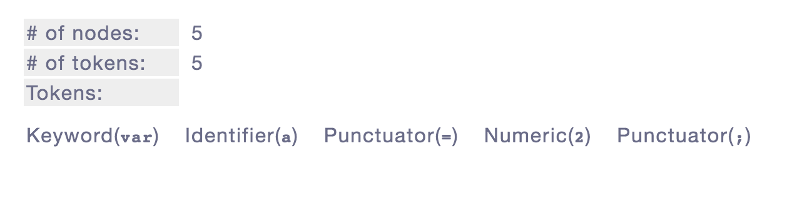
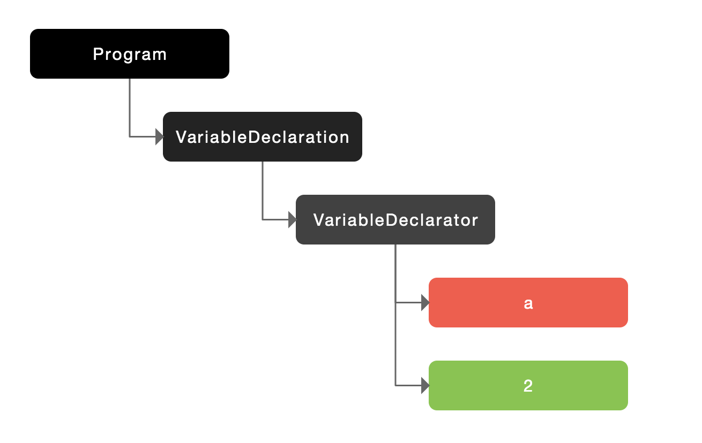
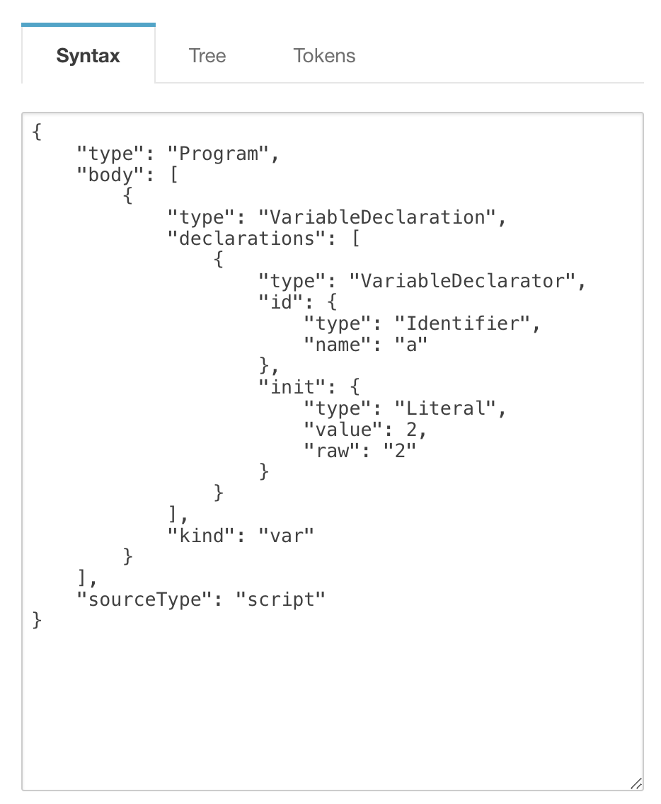
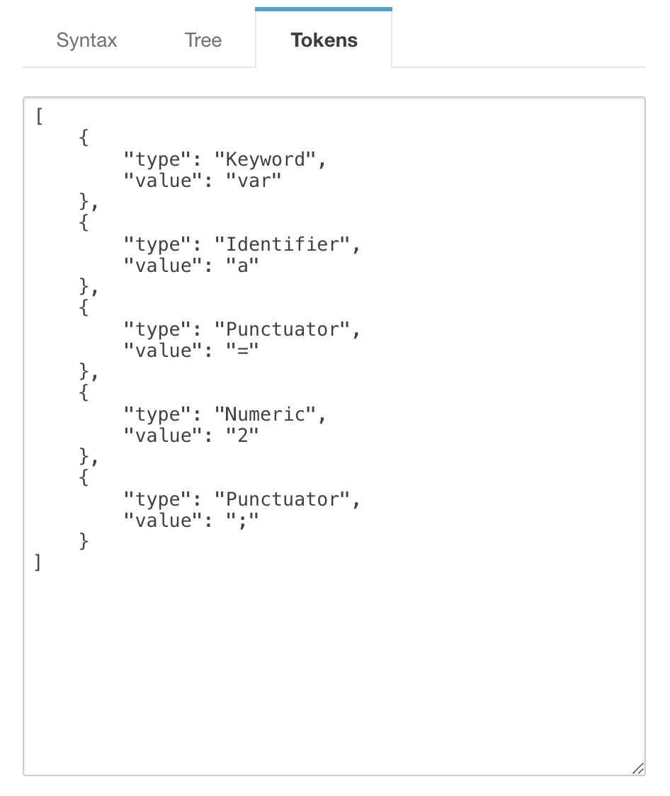

我们通常将 JavaScript 归类为“动态”或“解释执行”语言，但事实上它是一门编译语言。但与传统的编译语言不同，它`不是提前编译的，编译结果也不能在分布式系统中进行移植`。简单的说就是 **JavaScript 大部分情况下编译发生在代码执行前的几微秒**。

## 编译型语言 vs 解释型语言

编译型语言写的程序执行之前，需要一个专门的编译过程，把程序编译成为机器语言的文件。    
解释则不同，解释型语言编写的程序不需要编译。解释型语言在运行的时候才翻译。

## 传统的编译流程

在传统编译语言的流程中，程序中的一段源代码在执行之前会经历三个步骤：`分词/词法分析`、`解析/语法分析`、`代码生成`，统称为“编译”。

* **分词/词法分析(Tokenizing/Lexing)**
这个过程会将由字符组成的字符串分解成(对编程语言来说)有意义的代码块，这些代码块被称为`词法单元(token)`。
例如`var a = 2;`。这段程序会被分解成为这些词法单元：`var、a、=、2 、;`。空格是否会被当作词法单元，取决于空格在这门语言中是否具有意义。   
如下图：
 

* **解析/语法分析(Parsing)**
这个过程是将词法单元流（数组）转换成一个由元素逐级嵌套所组成的代表了程序语法结构的树。这个树称为“抽象语法树”(Abstract Syntax Tree)，简称"AST"。
[这个工具能在线可视化解析出一段代码的抽象语法树](http://resources.jointjs.com/demos/javascript-ast)
[这个可以进一步看更详尽的信息](https://esprima.org/demo/parse.html)
例如：`var a = 2;`生成的抽象语法树如下图所示：

详细信息如下：
<div style="display: flex;">


</div>

* **代码生成**
将 AST 转换为可执行代码的过程称被称为代码生成。这个过程与语言、目标平台等息息相关。   
抛开具体细节，简单来说就是有某种方法可以将` var a = 2; `的 AST 转化为一组机器指令，用来创建一个叫作 a 的变量(包括分配内存等)，并将一个值储存在 a 中。

## JavaScript 编译
比起那些编译过程只有三个步骤的语言的编译器，JavaScript 引擎要复杂得多,它在这部分做了许多优化： 
	* 一是在语法分析和代码生成阶段有特定的步骤来对运行性能进行优化，（例如对冗余元素进行优化）目的是提高编译后的执行效率。。
	* 二是对编译过程进行优化（例如JIT，延迟编译或者重编译），目的是缩短编译过程，保证性能最佳。


### 参与编译的成员
* **JavaScript引擎** ：从头到尾负责整个 JavaScript 程序的编译及执行过程。
* **编译器** ：负责语法分析及代码生成等脏活累活。
* **作用域** ：负责收集并维护由所有声明的标识符(变量)组成的一系列查询，并实施一套非常严格的规则，确定当前执行的代码对这些标识符的访问权限。

### 工作流程
以`var a = 2;`为例解释一下它的工作流程：这段程序,引擎认为这里有两个完全不同的声明：一个由编译器在编译时处理，另一个则由引擎在运行时处理。 

**编译器**首先会将这段程序分解成词法单元，然后将词法单元解析成一个树结构。但是当编译器开始进行代码生成时，它对这段程序的处理方式会和预期的有所不同。

**引擎**会为变量 a 进行 `LHS` 查询。另外一个查找的类型叫作 `RHS`。换句话说，当变量出现在赋值操作的左侧时进行 LHS 查询，出现在右侧时进行 RHS 查询。讲得更准确一点，RHS 查询与简单地查找某个变量的值别无二致，而 LHS 查询则是试图 找到变量的容器本身，从而可以对其赋值。从这个角度说，RHS 并不是真正意义上的“赋值操作的右侧”，更准确地说是“非左侧”。
```
// 在这里所说的都是对a进行的查找
var a = 2;  // 对变量进行赋值所执行的查询叫 LHS。
var b = a + 2; // 找到并使用变量值所执行的查询叫 RHS。
console.log(a) //会进行RHS查询
```


* **编译器处理步骤如下**
	1. 遇到 `var a`，编译器会询问作用域是否已经有一个该名称的变量存在于同一个作用域的集合中。如果是，编译器会忽略该声明，继续进行编译;否则它会要求作用域在当前作用域的集合中声明一个新的变量，并命名为 a ,因为只是声明，所以值是undefined。
	2. 接下来编译器会为引擎生成运行时所需的代码，这些代码被用来处理` a = 2 `这个赋值操作。引擎运行时会首先询问作用域，在当前的作用域集合中是否存在一个叫作 a 的变量。如果是，引擎就会使用这个变量;如果否，引擎会继续查找该变量。

* **引擎会进行如下处理**
	1. 引擎会创建一个执行环境(作用域)。
	2. `a = 2;`会查询(LHS 查询)变量 a 并对其进行赋值。

**总结**：变量的赋值操作会执行两个动作，首先编译器会在当前作用域中声明一个变量(如果之前没有声明过)，然后在运行时引擎会在作用域中查找该变量，如果能够找到就会对它赋值。

看到这里你们也就应该明白为什么js中会有声明提升（变量、函数）了。

**小测验**
1、 找到其中所有的LHS查询。(这里有3处!)
2、 找到其中所有的RHS查询。(这里有4处!)
```
function foo(a) { 
  var b = a;
  return a + b;
}
var c = foo( 2 );

```

之前我们讨论的都是在同一作用域中的情况，如果是在多个作用域中，引擎会怎么进行查找/赋值呢?
 
### 作用域嵌套

当一个块或函数嵌套在另一个块或函数中时，就发生了`作用域的嵌套`。因此，在当前作用域中无法找到某个变量时，引擎就会在外层嵌套的作用域中继续查找，直到找到该变量，或抵达最外层的作用域（也就是全局作用域）为止。


```
function foo(a) {
   console.log(a + b);  // 这里对 b 进行的 RHS 查询在 foo 作用域中无法找到
}
var b = 2;

foo(2);    // 4
```


