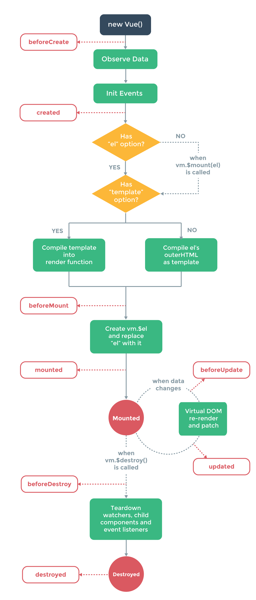

Vue 生命周期钩子有`beforeCreate`、`created`、`beforeMount`、`mounted`、`beforeUpdate`、`updated`、`activated`、`deactivated`、`beforeDestroy`、`destroyed`、`errorCaptured`。
所有的生命周期钩子自动绑定`this`上下文到实例中，因此你可以访问数据，对属性和方法进行运算。这意味着 **你不能使用箭头函数来定义一个生命周期方法**。


## beforeCreate
**在实例初始化之后，数据观测 (data observer) 和 event/watcher 事件配置之前被调用。**注意是之前，此时data、watcher、methods统统滴没有。这个时候的vue实例还什么都没有，但是$route对象是存在的，可以根据路由信息进行重定向之类的操作。

## created
**在实例创建完成后被立即调用。在这一步，实例已完成以下的配置：数据观测 (data observer)，属性和方法的运算，watch/event 事件回调。然而，挂载阶段还没开始，`$el`属性目前不可见。**此时 this.$data 可以访问，`watcher`、`events`、`methods`也出现了，若根据后台接口动态改变data和methods的场景下，可以使用。

## beforeMount
**在挂载开始之前被调用：相关的`render`函数首次被调用。该钩子在服务器端渲染期间不被调用。**但是render正在执行中，此时DOM还是无法操作的。相比于created生命周期，此时只是多了一个`$el`的属性，然而其值为`undefined`。使用场景我上文已经提到了，页面渲染时所需要的数据，应尽量在这之前完成赋值。

## mounted
**`el`被新创建的`vm.$el`替换，并挂载到实例上去之后调用该钩子。如果`root`实例挂载了一个文档内元素，当`mounted`被调用时`vm.$el`也在文档内。**此时元素已经渲染完成了，依赖于DOM的代码就放在这里吧~比如监听DOM事件。**该钩子在服务器端渲染期间不被调用。**

注意`mounted`不会承诺所有的子组件也都一起被挂载。如果你希望等到整个视图都渲染完毕，可以用 `vm.$nextTick` 替换掉 `mounted`：
```
mounted: function () {
  this.$nextTick(function () {
    // Code that will run only after the
    // entire view has been rendered
  })
}
```

## beforeUpdate
**数据更新时调用，发生在虚拟 DOM 重新渲染和打补丁之前。**你可以在这个钩子中进一步地更改状态(`$vm.data`)，这不会触发附加的重渲染过程。
**该钩子在服务器端渲染期间不被调用。**

## updated
**由于数据更改导致的虚拟 DOM 重新渲染和打补丁，在这之后会调用该钩子。**
当这个钩子被调用时，组件 DOM 的data已经更新，所以你现在可以执行依赖于 DOM 的操作。然而在大多数情况下，你应该`避免在此期间更改状态`。如果要相应状态改变，通常最好使用`计算属性`或`watcher`取而代之。否则会继续触发`beforeUpdate`、`updated`这两个生命周期，进入死循环！
注意 `updated`不会承诺所有的子组件也都一起被重绘。如果你希望等到整个视图都重绘完毕，可以用 `vm.$nextTick` 替换掉`updated`：
```
updated: function () {
  this.$nextTick(function () {
    // Code that will run only after the
    // entire view has been re-rendered
  })
}
```
**该钩子在服务器端渲染期间不被调用。**

## activated
`keep-alive`组件激活时调用。
**该钩子在服务器端渲染期间不被调用。**


## deactivated
`keep-alive`组件停用时调用。
**该钩子在服务器端渲染期间不被调用。**

## beforeDestroy
实例销毁之前调用。在这一步，实例仍然完全可用。
**该钩子在服务器端渲染期间不被调用。**

## destroyed
Vue 实例销毁后调用。调用后，Vue 实例指示的所有东西都会解绑定，所有的事件监听器会被移除，所有的子实例也会被销毁。
**该钩子在服务器端渲染期间不被调用。**

## errorCaptured  (2.5.0+ 新增)
当捕获一个来自子孙组件的错误时被调用。此钩子会收到三个参数：`错误对象`、`发生错误的组件实例`以及一个`包含错误来源信息的字符串`。此钩子可以返回`false`以阻止该错误继续向上传播。
**错误传播规则**
 * 默认情况下，如果全局的`config.errorHandler`被定义，所有的错误仍会发送它，因此这些错误仍让会向单一的分析服务的地方进行汇报。
 * 如果一个组件的继承或父级从属链路中存在多个`errorCaptured`钩子，则它们将会被相同的错误逐个唤起。
 * 如果此`errorCaptured`钩子自身抛出了一个错误，则这个新错误和原本被捕获的错误都会发送给全局的`config.errorHandler`。
 * 一个`errorCaptured`钩子能够返回`false`以阻止错误继续向上传播。本质上是说“这个错误已经被搞定了且应该被忽略”。它会阻止其它任何会被这个错误唤起的`errorCaptured`钩子和全局的`config.errorHandler`。

>你可以在此钩子中修改组件的状态。因此在模板或渲染函数中设置其它内容的短路条件非常重要，它可以防止当一个错误被捕获时该组件进入一个无限的渲染循环。

