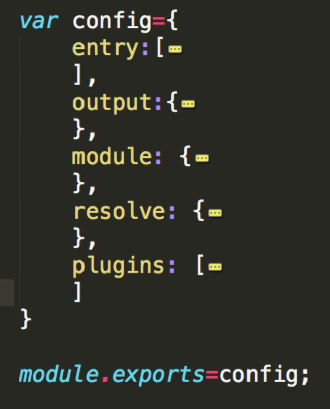

# webpack简介

Webpack 是当下最热门的前端资源模块化管理和打包工具。它可以将许多松散的模块按照依赖和规则打包成符合生产环境部署的前端资源。还可以将按需加载的模块进行代码分隔，等到实际需要的时候再异步加载。通过 loader 的转换，任何形式的资源都可以视作模块，比如 CommonJs 模块、 AMD 模块、 ES6 模块、CSS、图片、 JSON、Coffeescript、 LESS 等。

# Webpack配置
Webpack 配置项有如下几点：

* **entry**: 入口，定义要打包的文件。（即app第一个启动文件）
* **output**: 出口，定义打包输出的文件，包括路径（path），文件名（filename），还可能有运行时的访问路径（publicPath）参数。
* **module**: webpack将所有的资源都看做是模块，而模块就需要加载器；主要定义一些loaders,定义哪些后缀名的文件应该用哪些loader。
* **resolve**: 定义能够被打包的文件，文件后缀名 
* **plugins**: 定义一些额外的插件     

## 加载器配置（module）

注：module 的加载顺序是从右往左的

css 文件使用： style-loader，css-loader ，sass-loader或less-loader
js 文件使用： babel-loader，babel-preset-es2015，babel-preset-react，jsx-loader
图片文件使用：url-loader、file-loader、image-webpack-loader

